# To-Be Sorted / Verified

OSINT Investigations

Wednesday, October 28, 2020

7:25 PM

REFERENCE: <https://www.cybrary.it/blog/0p3n/osint-investigations/>

 

> I am sure many people that use OSINT are aware of these tools and
> links; however, information, and acquiring that information from all
> sources, is relevant and should never be overlooked. Hopefully, this
> will come in handy for OSINT investigations.I have listed some
> resources that are known within the hacker community in acquiring
> information on many entities, this includes all aspects of people and
> companies from email searches, username searches, phrases, phone
> numbers and even pictures.Many of the resources are free however some
> do charge an access fee for a more thorough search. I am unable to
> suggest which of these services are worth the money as I have never
> paid for a resource as the information is out there somewhere and just
> needs to be found

1.  > Understanding who owns a domain is very easy online, however
    > sometimes a domain is protected by cloud flare, this can stop and
    > investigation in its tracks very quickly. Without waiting time for
    > policy and emails from a web hoster one is able to sometimes be
    > able to get around Cloudflare and get the correct IP address with
    > some handy online tools. These
    > are: <https://dnsdumpster.com/> and [http://www.crimeflare.com/cfs.html](https://www.crimeflare.com/cfs.html)

2.  > One of the BEST Free DNS lookup tools on the internet: The NSA
    > uses this. <https://www.robtex.com/>another noteworthy DNS tool to
    > use is <http://serversniff.net.w3snoop.com/> besides this the only
    > one that comes to mind that will probably already be in your
    > arsenal is <http://whois.domaintools.com/>

3.  > Social networks can be used to find family relations however moose
    > roots can be found to do the same thing without letting on that
    > someone has looked at your profile. They are also good to find
    > password reset
    > questions. <http://birth-records.mooseroots.com/> and <http://marriage-divorce-records.mooseroots.com/> This
    > one is good to be able to find
    > sub-sites. [http://www.mooseroots.com](http://www.mooseroots.com/)Another
    > good site to mention
    > is [https://www.advancedbackgroundchecks.com/ ](https://www.advancedbackgroundchecks.com/)this
    > is great for background checks and a good resource to find a
    > person’s location if one has a vague idea of where someone
    > lives. <https://www.advancedbackgroundchecks.com/>

4.  > While this site links off to other sites (some requiring money) it
    > does give some good information. This is has gone downhill of late
    > and is not as good as it once was, still worth mentioning
    > though [http://www.peekyou.com](http://www.peekyou.com/).

5.  > Search for emails, names, usernames
    > here: <http://com.lullar.com/> Not as many of results returned
    > as other sites. Though, in saying that, there are not as many
    > links to commercial sites either.

6.  > One of my personal favorites\! <http://checkusernames.com/> Not
    > meant for profiling but works well for the task. Able to find a
    > specific username on many sites. From there you are able to
    > look at the profile that has taken the username. Saves time in
    > checking out accounts on each site.

7.  > This one is similar to the above website but claims to check over
    > 500 sites instead. Probably a good paid
    > site <http://knowem.com/> this is beyond my financial capacity I
    > have never used it but I understand from others that it is very
    > useful.

8.  > This was once a Spock “Single Point of Contact by Keyword). This
    > has changed over the years and isn’t as good anymore. It changed
    > when it was bought out by a company named Intelius. You are able
    > to search; name, phone, email and screen name. Unfortunately only
    > for US data and is now commercial. <http://www.zabasearch.com/>

9.  > Able to search name, email, username and phone. Results can be
    > noisy not to mention the links to paid sites. Can be a nice
    > starting point to lead to other areas. <https://pipl.com/>

10. > This one is very similar to the above website good for
    > footprinting: <http://www.123people.com/> links that are given are
    > for some paid and some not. I am unable to evaluate any of the
    > commercial sites as I find it more of a challenge to find the
    > information without paying.

11. > This one can be a bit of a tart or information tease. It gives
    > some good results but most are for commercial sites. It is a good
    > starting point to lead to other quires. <http://www.spokeo.com/>

12. > Search people by name or keyword. You’re able to use this as a
    > username search as well I have found. <http://webmii.com/>

13. > Good to find where someone works. Much of the information is from
    > LinkedIn or Indeed.com <http://www.zoominfo.com/>

14. > A picture finding website, this is good in finding duplicate
    > pictures of a profile account to see it’s been stolen from another
    > account or to be able to link the picture to other
    > websites. <http://tineye.com/>

15. > Sometimes people upload documents or pictures but remove them.
    > This site might help to find deleted
    > info. <http://www.archive.org/web/web.php>

16. > This is the hacker search engine without going onto the deep web
    > this is available for the surface users: <https://www.shodan.io/>

17. > Great site for a multitude of reasons. Online networking tools
    > including a port forward tester phone number geolocator reverse
    > email look-up and more. <http://www.yougetsignal.com/>

18. > Add-ons for Firefox can be very valuable. One, in particular, that
    > I would name is Passive Recon:
    > <https://addons.mozilla.org/en-US/firefox/addon/passiverecon/>

19. > Another favorite of mine is <http://www.yougetsignal.com/> go
    > check it out\! Many tools are available.

20. > Number one in my books
    > Maltego: <https://www.paterva.com/web7/index.php>

21. > A paid version of the above is <https://www.palantir.com/>

22. > This one is pretty good too, should be in any OSINT investigators
    > tool list: <http://dradisframework.org/>

23. > Linux tools: Metagoofil is great OSINT information gathering
    > tools. Able to extract metadata from a target. Able to extract MAC
    > address. This gives an attacker an idea of the hardware used in
    > the network. Can be used to guess the type of OS running and the
    > network names. It is also good at extracting network path
    > information which can be used to map the network. Brute force is
    > an available function with this
    > tool. <http://www.edge-security.com/metagoofil.php>

24. > Google hacking database. OSINT is not complete without some google
    > hacking. This helps in understanding Dorks and search quires while
    > helping find information on
    > google. <https://www.exploit-db.com/google-hacking-database/>

25. > FOCA is also a good network infrastructure mapping tool and can be
    > used for
    > OSINT. <http://null-byte.wonderhowto.com/how-to/hack-like-pro-extract-metadata-from-websites-using-foca-for-windows-0155076/>

26. > Social Engineer Toolkit. Tool for as you can see…social
    > engineering. Includes spear phishing and web attack vectors. Can
    > work with
    > Metasploit: <http://www.social-engineer.org/framework/se-tools/computer-based/social-engineer-toolkit-set/>

27. > This tool allows us to gather the geolocation that is related to
    > information about users from social networking
    > platforms. <http://www.geocreepy.com/>

28. > This automates recon from, Linkedin, Jigsaw, Shodan and others.
    > Good Linux tool <https://bitbucket.org/LaNMaSteR53/recon-ng>

> \*Others would argue that GREP, the Linux command, is better than all
> of these combined\! I; however, wouldn’t go that far. It is very
> useful, though.All the tools mentioned should get you off to a good
> start. Bookmark the sites\! Trust me they will come in handy in some
> way or another. Please be good with this information. With great
> knowledge comes great responsibility\! (Insert other cheesy movie
> quotes about responsibility) :pA good hacker and researcher
> understand the following: Don’t be lame and use them for malicious
> activities. Or I** WILL** find you and make an example out of you\!Ok
> maybe over the top a little, but be responsible and don’t use it to
> DOX
> 
>  
> 
> *From \<<https://www.cybrary.it/blog/0p3n/osint-investigations/>\>*

 

Articles

Tuesday, January 12, 2021

4:14 PM

 

  - > Blogs
    
      - > <https://webintmaster.com/how-to-directory/>
    
      - > <https://www.getrevue.co/profile/cybersecstu>
        
          - > TODO: Review

 

**OSINT: How to find information on anyone**

Tuesday, January 12, 2021

4:14 PM

SOURCE:
<https://medium.com/the-first-digit/osint-how-to-find-information-on-anyone-5029a3c7fd56>

 

 

 

 

 

Critical Tools

Wednesday, August 12, 2020

4:45 PM

  - > TOR
    
      - > Description
    
      - > INSTRUCTIONS HERE  
        >  

  - > Googler
    
      - > Using google, but via terminal.

  - > Tinfoleak
    
      - > Gets detailed info about a Twitter user.  
        >  

  - > DumpsterDiver
    
      - > {Maybe?}  
        >  

  - > theHarvester  
    >  

  - > Instaloctrack  
    >  

  - >  

 

REFERENCE:

  - > <https://github.com/xFreed0m/OSINTer/blob/master/OSINTer.sh>

 

SOCKPUPPET

Wednesday, October 28, 2020

10:52 PM

 

  - > SockPuppet Information
    
      - > <https://www.aaroncti.com/lets-talk-about-sockpuppet-accounts/>

  - > Creating an Effective Sock Puppet for OSINT Investigations
    
      - > <https://jakecreps.com/2018/11/02/sock-puppets/>

  - > Gallery of AI Generated Faces
    
      - > This could potentially help you with finding a picture, if you
        > do not want to use your own.
    
      - > <https://generated.photos/faces>

 

Searching

Wednesday, October 28, 2020

7:20 PM

Google Dorks

  - > <https://osintcurio.us/2019/12/20/google-dorks/>

  - > Includes various flow charts about different social medias, and
    > how much information they contain for an OSINT investigation.
    
      - > <https://github.com/sinwindie/OSINT>

 

 

Tools - Not Critical

Saturday, February 20, 2021

1:54 PM

Potentially useful tools, and not critical either.

 

  - > OSINT themed VMS
    
      - > TODO
        
          - > TraceLabs

 

 

People

Thursday, October 29, 2020

7:02 PM

 

  - > Peoplefinders.com

  - > PeopleSearchnow.com

 

 

Email / Passwords / Phone

Sunday, September 20, 2020

3:22 AM

 

  - > <https://github.com/khast3x/h8mail>
    
      - > This could be a secondary git repo

  - > <https://github.com/tracelabs/h8mail/>
    
      - > Potentially the original git repo

  - > <https://github.com/sundowndev/PhoneInfoga>

  - >  

 

 

Geo Location

Sunday, September 20, 2020

3:08 AM

 

  - > Google Earth
    
      - > <https://www.google.com/earth/>

  - > <https://www.geocreepy.com/>

  - > <https://geotips.net/>
    
      - > "Tips and tricks for GeoGuessr game"

  - > GEOINSTsearch
    
      - > <https://cse.google.com/cse?cx=015328649639895072395:sbv3zyxzmji#gsc.tab=0>
    
      - > GEOINTsearch – it delivers results that have the Google Maps
        > shortened tag from Twitter, Reddit and 4Chan platforms,
        > essentially delivering results on geolocation and Google Maps
        > references.

>  
> 
>  
> 
>  
> 
>  
> 
> 
> 
>  
> 
>  

  - > Combines, and syncs the navigation of Google Maps, and Google
    > Street view on one page.
    
      - > <https://www.mapchannels.com/DualMaps.aspx>

 

 

Social Media

Monday, July 27, 2020

9:36 PM

TODO:

  - > Sock puppet creation article

  - > Social media search strategies
    
      - > <https://www.lorandbodo.com/blog/social-media-search-strategies>

  - > Locate other SOCMINT correlation scripts.  
    >  
    
      - > Master search
        
          - > <https://usersearch.org/>
        
          - > <https://namechk.com>
        
          - > <https://github.com/sherlock-project/sherlock>
        
          - > <https://whatsmyname.app>
        
          - > <https://checkusernames.com/>
        
          - > <https://github.com/iojw/socialscan>
        
          - > <https://github.com/sherlock-project/sherlock>
        
          - > <https://github.com/wishihab/userrecon>
    
    <!-- end list -->
    
      - > Facebook
    
      - > Snapchat
    
      - > Twitter
    
      - > Instagram
    
      - > TickTok
    
      - > Paypal.me

 

 

Maltego - Transforms

Wednesday, August 12, 2020

4:31 PM

 

  - > TODO
    
      - > List some useful Maltego transforms that can be used without
        > money.

 

Social Media

  - > General
    
      - > <https://cetas.paterva.com/TDS/runner/showseed/fastCSEs>

  - > Twitter
    
      - > Twint

 

 

Other

Wednesday, August 12, 2020

4:30 PM

These are links that need further detail, and explanation in this
document.

 

  - > <https://start.me/p/b5Aow7/asint_collection>

  - > <https://www.osinttechniques.com/osint-tools.html>

  - > <https://docs.google.com/spreadsheets/d/1_x3PXGOahhKT3-ePaWhb3hM1dVxjmBvsVlw6D6lilTQ/edit#gid=1116439221>

  - > <https://github.com/s0md3v/Photon>

  - > <https://intelx.io/>

  - > <https://osintframework.com/>

  - > <https://assets.losspreventionmedia.com/uploads/2018/11/OSINT_Handbook_June-2018_Final.pdf>

> \<\<OSINT\_Handbook\_June-2018\_Final.pdf\>\>
> 
>  

  - > <https://docs.google.com/spreadsheets/d/1klugQqw6POlBtuzon8S0b18-gpsDwX-5OYRrB7TyNEw/edit#gid=0>

  - > <https://medium.com/osint/the-osint-toolkit-3b9233d1cdf9>

  - > <https://medium.com/@micallst/osint-resources-for-2019-b15d55187c3f>

  - > [https://www.intezer.com/ost-map/\#](https://www.intezer.com/ost-map/)

  - > <https://github.com/tracelabs/searchparty-ctf-writeups/blob/master/searchparty-ctf-writeups.md>

  - > <https://i-intelligence.eu/uploads/public-documents/OSINT_Handbook_2020.pdf>
    
      - > \<\<OSINT\_Handbook\_2020.pdf\>\>

  - > <https://yoga.osint.ninja/>

  - > Joe Gray class docs on Google Drive drive link found here:
    > <https://github.com/jasnow/OSINT/blob/0a29e06860ddfe543497785b0f5bf39c06a57cd1/missing-ctf-notes.txt>
    
      - > People OSINT/OSINT for Missing Person (2019 - Joe Gray and
        > Advanced Persistent Security/The OSINTion
        
          - > \<\<Missing\_Persons.pdf\>\>

 

  - > Open-Source Intelligence ATP 2-22.9, HQ, Department of the Army
    
      - > \<\<atp2-22-9.pdf\>\>

>  

![Email Address Verify Address (Hunter.io) Remove Domain and Search
Usemame: Search Facebook by Email Address Document Search PIPL API
IntelTechniques Email Search Tool Pipi User Name Employer Real Name
Search Engines Google Yandex Bing Compromised Databases HIBP
Hacked-Emails Websites I Blogs user Names That's Them ReverseMails
Newsgroups DomainData Gravatar Social Networks Search Engines Verify
Address Email Permutator FB Password Reset Email Search Engines Gmail,
Yahoo, Hotmail, etc. Facebook Profile Email Assumptions (Work) Email
Assumptions (Personal) Social Networks IntelTechniques.com OSINT
Workflow Chart: Email Address Michael Bazzell's OSINT Flowcharts
](media/image3.png)

 

 

Image/Video Searching

Tuesday, October 20, 2020

6:44 PM

 

Video

Wednesday, October 28, 2020

7:44 PM

  - > Getting video from various sources for further analysis can be
    > done depending on the source.
    
      - > YouTube-ld
        
          - > Find the link.

 

Articles

Wednesday, October 28, 2020

7:29 PM

 

**Using Shadows & Sun’s Position for OSINT**

Wednesday, January 20, 2021

8:59 AM

> SOURCE:
> <https://s0md3v.medium.com/using-shadows-suns-position-for-osint-fc2378b5f709>
> 
>  
> 
>  
> 
>  
> 
>  
> 
> 
> 
> [Somdev
> Sangwan](https://s0md3v.medium.com/?source=post_page-----fc2378b5f709--------------------------------)
> 
> [1 hour ago·7 min
> read](https://s0md3v.medium.com/using-shadows-suns-position-for-osint-fc2378b5f709?source=post_page-----fc2378b5f709--------------------------------)
> 
> This article tries to cover all the basics that one needs to know to
> do what the title promises. Here’s a list of things we are going to
> cover in case you want to skip the basics:

  - > Hemispheres, Earth’s Axis & Poles

  - > Solar Elevation & Azimuth Angle

  - > Sun’s Position & Shadows

  - > Deductions

  - > The Actual

> Hemispheres, Earth’s Axis & Directions
> 
> 
> 
>  
> 
> 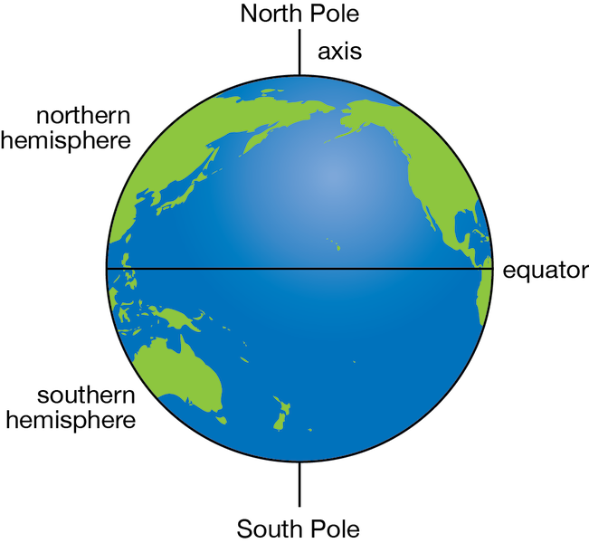

  - > Earth has a magnetic field and like all magnets it has two
    > poles, **north** and **south**.

  - > The line joining north and south pole is called **earth’s axis**.

  - > **Equator** is an imaginary line that divides the earth into two
    > equal parts.

  - > These two equal parts are
    > called **northern** and **southern** hemispheres.

> Solar Elevation & Azimuth Angle
> 
> How do you describe the position of the sun in sky at a given time?
> It’s easy, you just need to describe how high the sun is in the sky
> and how *far* it is from the North direction. Finding these values is
> easy.

  - > Let’s say you are standing at a point, **A**.

  - > Find a point on the horizon directly below the sun and call
    > it **B**.

  - > Let’s call the visible center of the sun point **C**.

  - > Now, create a line **AD** which points to North direction.

> 
> 
>  
> 
> 
> 
> The angle between the line **AB** and **AC** is called the **Solar
> Elevation Angle**. It tells us how high the sun is in the sky.
> 
> The angle between the line **AB** (direction of sun)
> and **AD **(north) is called the **Azimuth Angle**. It tells us the
> position of the Sun with respect to the North direction.
> 
> Sun’s Position & Shadows
> 
> We all know how the direction and length of shadows changes throughout
> the day as sun changes it’s position in the sky. Shadows are shorter
> when sun’s above your head in the noon and they become longer at
> evening or in morning when sun is near the horizon. Basic stuff.
> 
> But do you think a shadow of an object in March at 11 AM will have the
> same length and direction as the shadow of the same object in
> September at 11 AM? The answer is, no.
> 
> To understand why it happens, let’s take a look at this GIF which
> shows the earth orbiting the sun over the course of an year.
> 
> 
> 
>  
> 
> 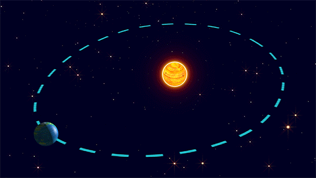
> 
> As you can see, the earth’s orbit is not a perfect circle and neither
> the Sun is the center of the orbit which is why it’s distance to the
> Sun changes over the year. In June, the sun is closest to the earth
> and in January, it’s the farthest. To add to it, the Earth’s axis is
> tilted at a angle of 23.5 degrees.
> 
> 
> 
>  
> 
> 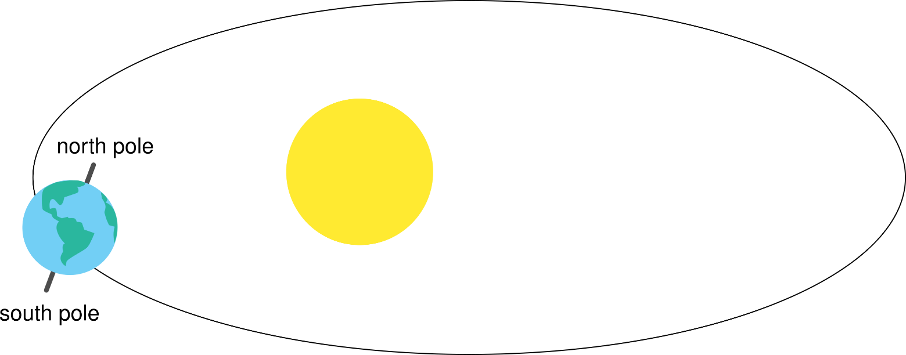
> 
> Due to this tilt, when the earth is closer to the sun (in June), sun
> rays hit the earth in this way:
> 
> 
> 
>  
> 
> 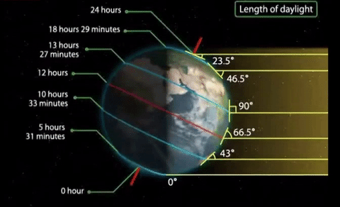
> 
> As you can see, the sun rays hit the Northern hemisphere in June at a
> higher angle and for longer time. As we progress through the year this
> situation gradually reverses and when it’s January, the Southern
> hemisphere gets the most and direct sun light and vice-versa.
> 
> The GIF above makes it clear that time of the year affects the angle
> sun rays hit a given place on earth which ultimately affects solar
> elevation and azimuth angles.
> 
> The Two Deductions
> 
> From what we have learned so far, we can make two deductions:
> 
> **Deduction:** If we know the Solar Altitude Angle, we can make a
> guess about the time of the day.
> 
> **Reason:** The length of the shadow changes according to the time of
> the day.
> 
> **Deduction:** If we know the co-ordinates of the object casting the
> shadow as well as the azimuth angle, we can make a guess about the
> time of the year.
> 
> **Reason:** Since the direction and length of the shadow at a given
> time at a given place changes throughout the year, it is possible to
> simulate shadows for the entire year and then pick the one that
> matches the given shadow.
> 
> Using These Deductions in OSINT
> 
> To put what we have learned so far to a test, let’s try to make an
> educated guess about when the following photo was taken.
> 
> 
> 
>  
> 
> 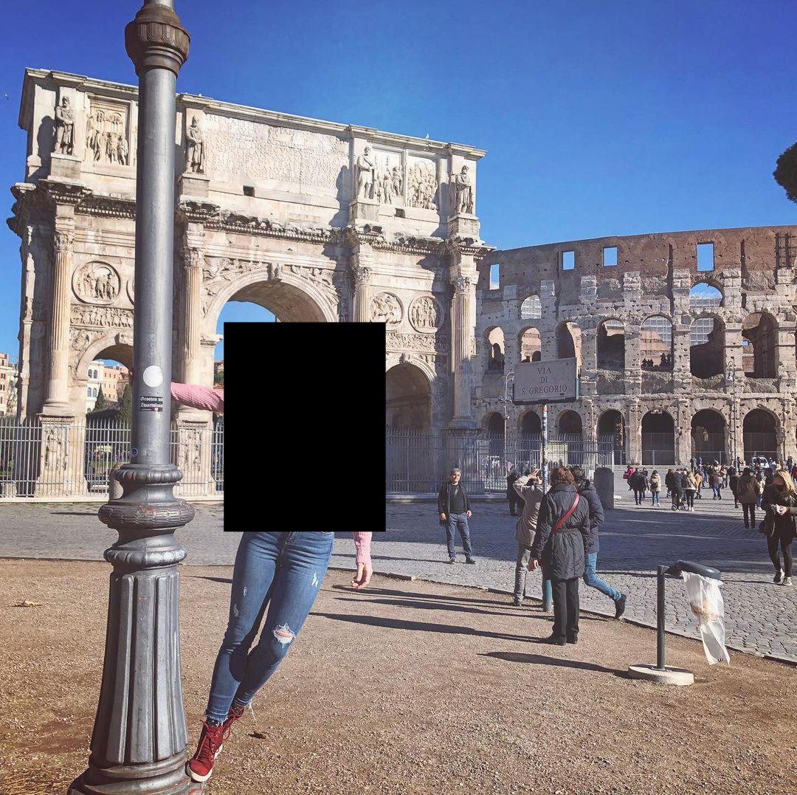
> 
> First, we must know the location where the photo was taken. I found
> the exact spot on Google earth and highlighted matching objects to
> validate my finding. The coordinates are 41.889695, 12.4912546.
> 
> 
> 
>  
> 
> 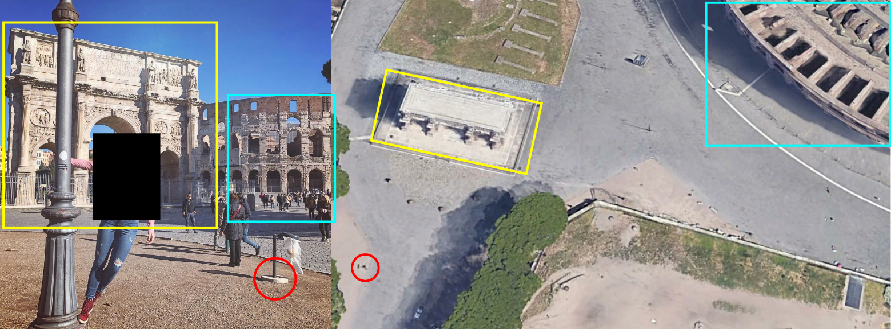
> 
> Our next objective is to find the north direction in photo.
> 
> There’s no definite methodology to do this and improvisation is needed
> based on the content of the photo/video. The technique I am
> demonstrating in this article takes advantage of the fact that
> position and angle of the camera in a photo/video might affect other
> angles in it but the ratio of those angles stays the same. So, if a
> angle **X** is 2 times bigger than angle **Y**, it will always appear
> 2 times bigger no matter how you take the photo.
> 
> Let’s get back to the business, scroll up a little and take a look at
> the photo above, do you see that circled little pole thingy? Let’s
> call it point **A** in our Google earth image.
> 
> 
> 
>  
> 
> 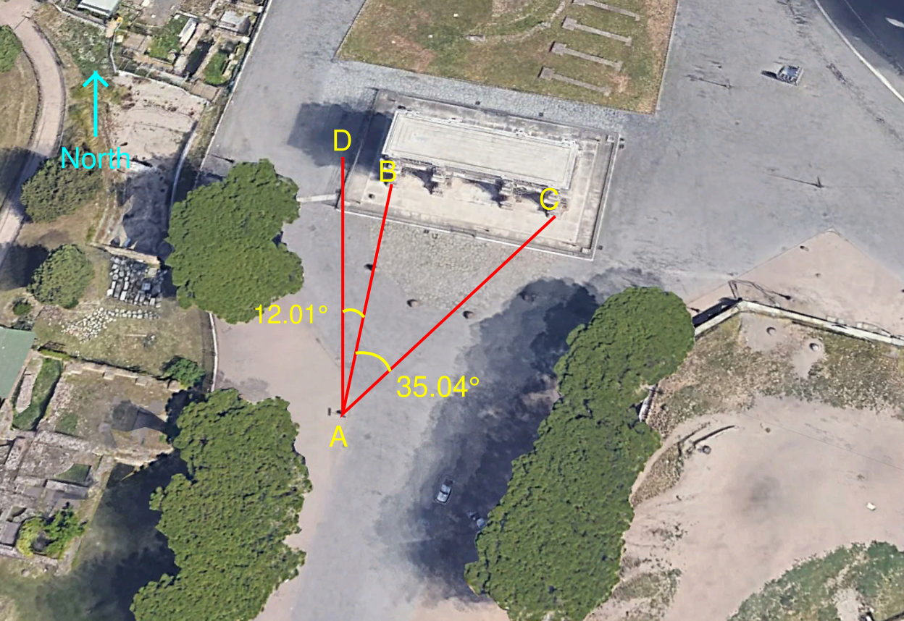
> 
> The left most and right most pillars of the arch point are
> named **B** and **C**, respectively. Also, in Google earth (and most
> of other maps), north is directly upwards by default so we draw a
> line **AD** directly upward to represent the north direction.
> 
> Next, we measure the ratio of the angles.
> 
> Angle DAB = 12.01°
> 
> Angle BAC = 35.04°35.04/12.01 = 2.92Angle BAC is 2.92 times larger
> than Angle DAB
> 
> To replicate this in our original photo, we will do the same things
> all over, point **A** is the pole thingy, point **B** is left most
> pillar and point **C** is the right most pillar.
> 
> Next, we draw a line **AD** such that the angle **DAB** is 2.92 times
> smaller than the angle **BAC**, this line gives us the north
> direction.
> 
> 
> 
>  
> 
> 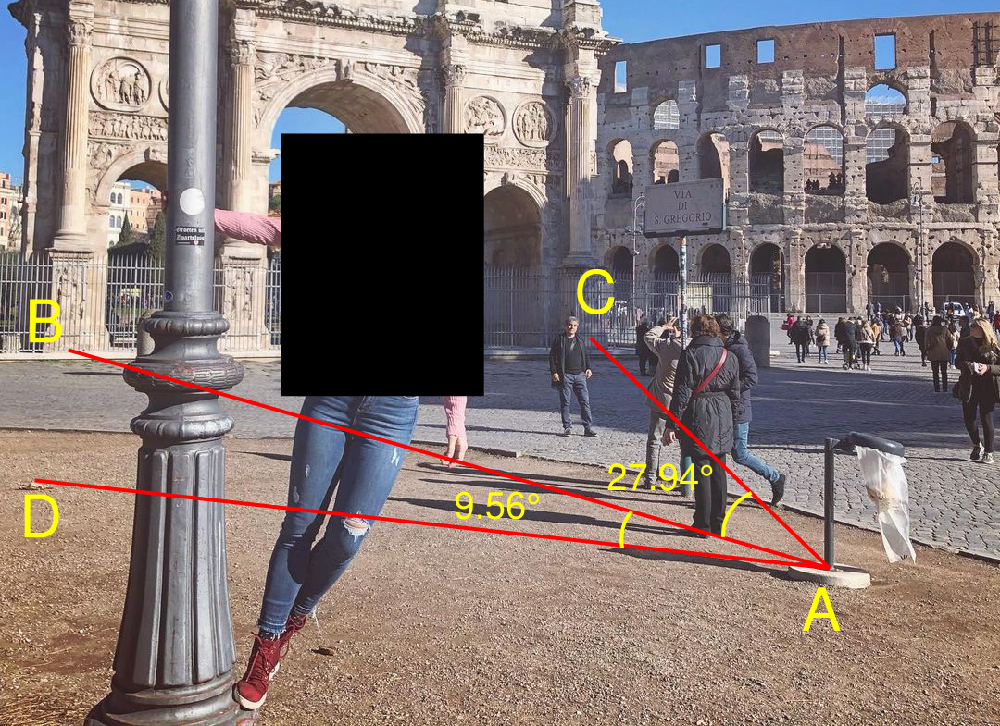
> 
> Next, we will find the Azimuth angle. Remember what is an Azimuth
> angle? It’s the angle between Sun’s direction and North. In our case,
> the sun seems to be exactly in the South so the angle Azimuth angle
> will be 180°. Remember, sun’s direction is always opposite to the
> shadow’s direction.
> 
> 
> 
>  
> 
> 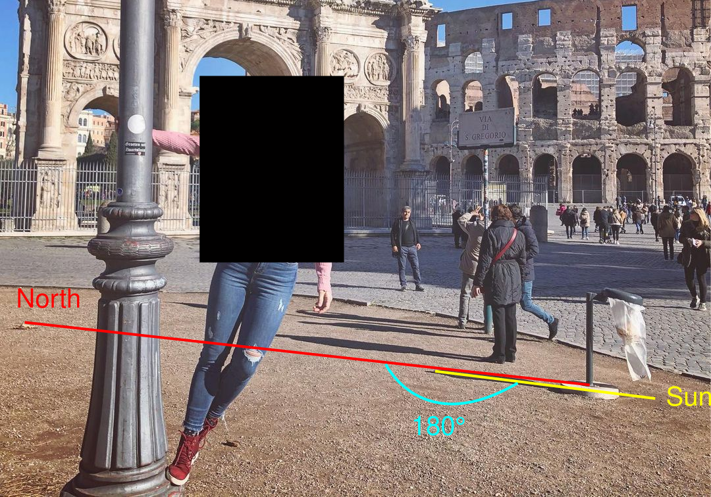
> 
> Now is the time for the last calculation, the ratio between an object
> and it’s length. You can use any unit of length because we are just
> calculating ratio.
> 
> 
> 
>  
> 
> 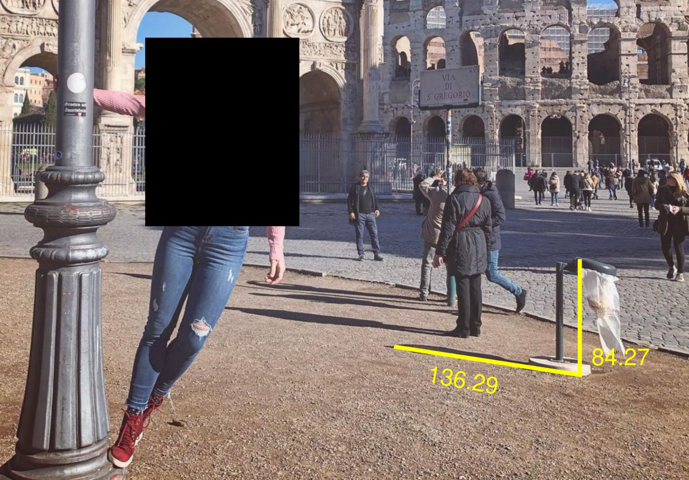
> 
> As you can see, the shadow is 1.61 times large the object itself and
> that’s the final piece of information we needed to know.
> 
> So, we have this so far:

  - > Coordinates: 41.889695, 12.4912546

  - > Azimuth Angle: 180°

  - > Shadow/Length ratio: 1.61

> Now, we just need to find at what time, the sun will be 180° from the
> north and make shadows 1.61 times larger than objects.
> 
> To do this, we will use an amazing online
> tool: [www.suncalc.org](http://www.suncalc.org/). It is a tool that
> can simulate sun’s position and other related data from a given time
> and place.
> 
> Just enter the location and choose any time of any year, from there on
> you can keep changing the month and time of the day until you get a
> azimuth angle and shadow length close to your result. Once you are
> close, you can start narrowing down and start changing day of the
> month and pick the one the produces the closest result.
> 
> 
> 
>  
> 
> 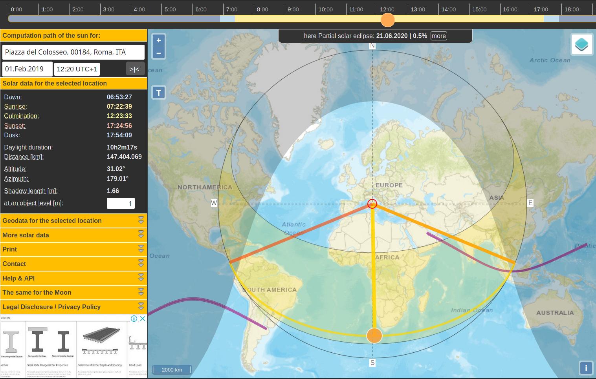
> 
> In this case, the closest match was February 1st-2nd, and 12:20 PM,
> when shadow length of is 1.66 (close to 1.61) and Azimuth angle is
> 179.01 (close to 180°).
> 
> To guess the year, you will need to find imagery of the location over
> the years and match them against the target photo which isn’t in scope
> of the article, maybe next time.
> 
> One last tip that I would like to give is that if shadow is in south,
> you are probably in the southern hemisphere and vice versa. You can
> play around
> with [SunCalc](https://s0md3v.medium.com/www.suncalc.org) to see
> what I mean.
> 
> That’s all for this time folks, hope this helps in your future
> investigations.
> 
> Further Reading

  - > [Shadow
    > Angles](https://www.boeingconsult.com/Environment/shade-angle.htm)

  - > [Using the sun and shadows for
    > geolocation](https://www.bellingcat.com/resources/2020/12/03/using-the-sun-and-the-shadows-for-geolocation/) by
    > Bellingcat

  - > [An Execution in
    > Hadrut](https://www.bellingcat.com/news/rest-of-world/2020/10/15/an-execution-in-hadrut-karabakh/) by
    > BellingCat

  - > [Shadows and SunCalc. Calculating time using clues in a
    > photo](https://medium.com/quiztime/lining-up-shadows-2351ae106cec) by
    > Sector035

> 3 
> 
> 1

  - > [Osint](https://medium.com/tag/osint)

  - > [Investigation](https://medium.com/tag/investigation)

  - > [Journalism](https://medium.com/tag/journalism)

  - > [Geology](https://medium.com/tag/geology)

  - > [Science](https://medium.com/tag/science)

> [More from Somdev
> Sangwan](https://s0md3v.medium.com/?source=follow_footer-------------------------------------)
> 
> Follow
> 
> I make stuff, I break stuff and I make stuff that breaks stuff.
> 
> [Jul 23, 2019](https://medium.com/@s0md3v/illusion-of-entropy-exploiting-rngs-b33c4b53f4bc?source=follow_footer---------0----------------------------)
> 
> [**Illusion of Randomness & Exploiting
> RNGs**](https://medium.com/@s0md3v/illusion-of-entropy-exploiting-rngs-b33c4b53f4bc?source=follow_footer---------0----------------------------)
> 
> Entropy, a more scientific term for what we call “randomness” is the
> measure of uncertainty or disorder.
> 
> But the question is, how do we decide if something is random and more
> importantly, how much? Let’s find out\!
> 
> Illusion of uncertainty
> 
> Is the direction of a ball bouncing off a wall is uncertain? No. It
> depends on the angle on which it made contact with the wall. It’s not
> random.
> 
> What if you close your eyes and type a long string really fast? Will
> it be random? I made this [little
> webpage](https://s0md3v.github.io/lab/keystrokes.html) so you can find
> it yourself.
> 
> You will notice that the string you typed isn’t even as random as a
> text written in English, let alone encrypted data.
> 
> Wait a second, English text isn’t random? Yes it isn’t. Some alphabets
> are used more than others, some words are used more than others, there
> are more English words with 5 alphabets than words with alphabets with
> 2 or 11 characters. All these properties add some certainty to the
> text which lowers the entropy.
> 
> And why isn’t your blindly typed “random” text random? Because while
> doing so, your fingers hit some keys more often than the others. Don’t
> believe me? …
> 
> [Read more · 4 min
> read](https://medium.com/@s0md3v/illusion-of-entropy-exploiting-rngs-b33c4b53f4bc?readmore=1&source=follow_footer---------0----------------------------)
> 
> 123
> 
>  
> 
> [Jul 12, 2019](https://medium.com/@somdevsangwan/deblurring-images-for-osint-part-2-ba564af8eb5d?source=follow_footer---------1----------------------------)
> 
> [**Deblurring images for OSINT —
> Part 2**](https://medium.com/@somdevsangwan/deblurring-images-for-osint-part-2-ba564af8eb5d?source=follow_footer---------1----------------------------)
> 
> Let’s reverse Pixelize blur.
> 
> ***Note:** GIMP is used as the photo editing tool in this tutorial.*
> 
> *There’s no way to retrieve 100% of the details from an image once
> it’s distorted.*
> 
> In the [previous
> article](https://medium.com/@somdevsangwan/unblurring-images-for-osint-and-more-part-1-5ee36db6a70b),
> we talked about how mathematical operations are used to apply filters
> to images and how we can deblur images that are blurred
> using **Gaussian blur**.
> 
> In this article, we will talk about another popular blurring method
> known as **Pixelize**. Images blurred using this method can be
> identified by visible “boxes”. Take a look at the following image for
> example
> 
> 
> 
>  
> 
> 
> 
> REDACTED
> 
> The Pixelize blur works by dividing an image into a number of squares
> and then replacing all the pixels in each square by average of their
> values.
> 
> For example, if a square has 7 black pixels and 7 white pixels, all
> the pixels in that square will become gray. …
> 
> [Read more · 3 min
> read](https://medium.com/@somdevsangwan/deblurring-images-for-osint-part-2-ba564af8eb5d?readmore=1&source=follow_footer---------1----------------------------)
> 
> 83
> 
> [1](https://medium.com/@somdevsangwan/deblurring-images-for-osint-part-2-ba564af8eb5d?responsesOpen=true&source=follow_footer---------1----------------------------)
> 
>  
> 
> [Jun 29, 2019](https://medium.com/@somdevsangwan/finding-vulnerabilities-in-source-code-8575ece385dc?source=follow_footer---------2----------------------------)
> 
> [**Finding vulnerabilities in Source
> Code**](https://medium.com/@somdevsangwan/finding-vulnerabilities-in-source-code-8575ece385dc?source=follow_footer---------2----------------------------)
> 
> Although I am not a professional source code auditor, I am a
> hyperactive programmer and security researcher. The article is based
> on my own experiences and reading various vulnerability reports
> throughout my journey in information security. Hence it might have
> some flaws that I would love to know about in the comments. Having
> that said, let’s get started.
> 
> Low hanging fruits
> 
> There are few things that can lead to discovering vulnerabilities
> without actually reading all the code. I am listing a few such
> techniques that I have found to be useful.
> 
> **Validating patches**
> 
> If previous versions of source code are available, go through the
> changelog to see if the developer has fixed any security
> vulnerabilities. Investigate the patches one by one. Pick the patched
> version of source code and compare it will the vulnerable version to
> understand what caused the vulnerability and what the developer did to
> patch it. Drink a glass of water and see if the patch has fixed the
> vulnerability properly or not, try bypassing the patch if possible. …
> 
> [Read more · 4 min
> read](https://medium.com/@somdevsangwan/finding-vulnerabilities-in-source-code-8575ece385dc?readmore=1&source=follow_footer---------2----------------------------)
> 
> 399
> 
> [1](https://medium.com/@somdevsangwan/finding-vulnerabilities-in-source-code-8575ece385dc?responsesOpen=true&source=follow_footer---------2----------------------------)
> 
>  
> 
> [Apr 28, 2019](https://medium.com/@somdevsangwan/learn-to-code-in-less-than-a-week-8f3da5e0ab29?source=follow_footer---------3----------------------------)
> 
> [**Learn to code in less than a
> week**](https://medium.com/@somdevsangwan/learn-to-code-in-less-than-a-week-8f3da5e0ab29?source=follow_footer---------3----------------------------)
> 
> 
> 
>  
> 
> 
> 
> Made with canva.com
> 
> Programming is an amazing skill to have and I believe it’s especially
> essential if you want to be good at information security. With the
> magic of programming, you can write exploits, automate things, get
> better understanding of how something works under the hood or find
> vulnerabilities going through source code.
> 
> If you are reading this article, you belong to one of the following
> classes

  - > You want to learn programming but not sure where to start

  - > You tried learning programming in the past but you found it hard

  - > You are insecure about your skills so you are here to see what I
    > have to…

> [Read more · 5 min
> read](https://medium.com/@somdevsangwan/learn-to-code-in-less-than-a-week-8f3da5e0ab29?readmore=1&source=follow_footer---------3----------------------------)
> 
> 841
> 
> [2](https://medium.com/@somdevsangwan/learn-to-code-in-less-than-a-week-8f3da5e0ab29?responsesOpen=true&source=follow_footer---------3----------------------------)
> 
>  
> 
> [Apr 22, 2019](https://medium.com/@s0md3v/how-i-found-5-redos-vulnerabilities-in-mod-security-crs-ce8474877e6e?source=follow_footer---------4----------------------------)
> 
> [**How I found 5 ReDOS Vulnerabilities in Mod Security
> CRS**](https://medium.com/@s0md3v/how-i-found-5-redos-vulnerabilities-in-mod-security-crs-ce8474877e6e?source=follow_footer---------4----------------------------)
> 
> *This write-up assumes that the reader has intermediate (or higher)
> knowledge of regular expressions. If you are not very familiar with
> regular expressions, you might want to check out [this
> tutorial](https://medium.com/factory-mind/regex-tutorial-a-simple-cheatsheet-by-examples-649dc1c3f285).
> You may also want to read [my introductory
> article](https://medium.com/@somdevsangwan/exploiting-regular-expressions-2192dbbd6936) about
> ReDOS.*
> 
> I have been spending a good amount of time writing ReDOS exploits and
> studying WAFs lately. To practice my skills in the real world, I
> chose [Mod Security Core Rule
> Set](https://github.com/SpiderLabs/owasp-modsecurity-crs) because it
> has tons of regular expressions and on top of that, these regular
> expressions are being used by WAFs in the wild to detect attacks. …
> 
>  
> 
> *From
> \<<https://s0md3v.medium.com/using-shadows-suns-position-for-osint-fc2378b5f709>\>*
> 
>  
> 
>  

 

**Using Shadows & Sun’s Position for OSINT - Backup**

Wednesday, January 20, 2021

9:00 AM

![Somdev Sangwan 1.3K Followers About Sign in Get started Using Shadows
& Sun's Position for OSINT Somdev Sangwan I hourago 7 min read This
article tries to cover all the basics that one needs to know to do what
the title promises. Here's a list of things we are going to cover in
case you want to skip the basics: • • • Hemispheres, Earth's Axis &
Poles Solar Elevation & Azimuth Angle Sun's Position & Shadows Ded
uctions The Actual Hemispheres, Earth's Axis & Directions northern
hemisphere southern hemisphere North Pole axis equator South Pole •
Earth has a magnetic field and like all magnets it has nvo poles, north
and south. • The line joining north and south pole is called earth's
axis. • Equator is an imaginary line that divides the earth into tvv'0
equal parts. • These t-vvo equal parts are called northern and southern
hemispheres. Solar Elevation & Azimuth Angle How do you describe the
position of the sun in sky at a given time? It's easy, you just need to
describe how high the sun is in the sky and how far it is from the North
direction. Finding these values is easy. 1. Let's say you are standing
at a point, A. 2. Find a point on the horizon directly below the sun and
call it B. 3. Let's call the visible center of the sun point C. 4. Now,
create a line AD which points to North direction. The angle between the
line AB and AC is called the Solar Elevation Angle. It tells us how high
the sun is in the sky. The angle between the line AB (direction of sun)
and AD (north) is called the Azimuth Angle. It tells us the position of
the Sun vvith respect to the North direction. Sun's Position & Shadows
We all know how the direction and length of shadows changes throughout
the day as sun changes it's position in the sky. Shadows are shorter
when sun's above your head in the noon and they become longer at evening
or in morning when sun is near the horizon. Basic stuff. But do you
think a shadow of an object in March at 11 AM will have the same length
and direction as the shadow of the same object in September at 11 AM?
The answer is, no. To understand why it happens, let's take a look at
this GIF which shows the earth orbiting the sun over the course of an
year. As you can see, the earth's orbit is not a perfect circle and
neither the Sun is the center of the orbit which is why it's distance to
the Sun changes over the year. In June, the sun is closest to the earth
and in January, it's the farthest. To add to it, the Earth's axis is
tilted at a angle of 23.5 degrees. Due to this tilt, when the earth is
closer to the sun (in June), sun rays hit the earth in this way: As you
can see, the sun rays hit the Northern hemisphere in June at a higher
angle and for longer time. As we progress through the year this
situation gradually reverses and when it's January, the Southern
hemisphere gets the most and direct sun light and vice-versa. The GIF
above makes it clear that time of the year affects the angle sun rays
hit a given place on earth which ultimately affects solar elevation and
azimuth angles. The Two Deductions From what we have learned so far, we
can make two deductions: Deduction: If we know the Solar Altitude Angle,
we can make a guess about the time of the day. Reason: The length of the
shadow changes according to the time of the day. Deduction: If we know
the co-ordinates of the object casting the shadow as well as the azimuth
angle, we can make a guess about the time of the year. Reason: Since the
direction and length of the shadow at a given time at a given place
changes throughout the year, it is possible to simulate shadows for the
entire year and then pick the one that matches the given shadow. using
These Deductions in OSINT To put what we have learned so far to a test,
let's a-y to make an educated guess about when the following photo was
taken. First, we must know the location where the photo was taken. I
found the exact spot on Google earth and highlighted matching objects to
validate my finding. The coordinates are 41.889695, 12.4912546. Our next
objective is to find the north direction in photo. There's no definite
methodology to do this and improvisation is needed based on the content
of the photo/video. The technique I am demonstrating in this article
takes advantage of the fact that position and angle of the camera in a
photo/video might affect other angles in it but the ratio of those
angles stays the same. So, if a angle X is 2 times bigger than angle Y,
it will always appear 2 times bigger no matter how you take the photo.
Let's get back to the business, scroll up a little and take a look at
the photo above, do you see that circled little pole thingy? Let's call
it point A in our Google earth image. The left most and right most
pillars of the arch point are named B and C, respectively. Also, in
Google earth (and most of other maps), north is directly upwards by
default so we draw a line AD directly upward to represent the north
direction. Next, we measure the ratio of the angles. = 12.010 = 33.040
's. 04/12.01 = 2.92 Angle BAC is Z . times Larger Chan Angie DAS To
replicate this in our original photo, we will do the same things all
over, point A is the pole thingy, point B is left most pillar and point
C is the right most pillar. Next, we draw a line AD such that the angle
DAB is 2.92 times smaller than the angle BAC, this line gives us the
north direction. Next, we will find the Azimuth angle. Remember what is
an Azimuth angle? It's the angle betwveen Sun's direction and North. In
our case, the sun seems to be exactly in the South so the angle Azimuth
angle will be 180'. Remember, sun's direction is always opposite to the
shadow\*s direction. Now is the time for the last calculation, the ratio
betwveen an object and it's length. You can use any unit of length
because we are just calculating ratio. As you can see, the shadow is
1.61 times large the object itself and that's the final piece of
information we needed to know. So, we have this so far: 1. Coordinates:
41.889695, 12.4912546 2. Azimuth Angle: 180' 3. Shadow/ Length ratio:
1.61 Now, we just need to find at what time, the sun vv-ill be 180' from
the north and make shadows 1.61 times larger than objects. To do this,
we will use an amazing online tool: vrnw.suncalc.org. It is a tool that
can simulate sun's position and other related data from a given time and
place. Just enter the location and choose any time of any year, from
there on you can keep changing the month and time of the day until you
get a azimuth angle and shadow length close to your result. Once you are
close, you can start narrowing down and start changing day of the month
and pick the one the produces the closest result. In this case, the
closest match was February 1st-2nd, and 12:20 PM, when shadow length of
is 1.66 (close to 1.61) and Azimuth angle is 179.01 (close to 1800). To
guess the year, you will need to find imagery of the location over the
years and match them against the target photo which isn't in scope of
the article, maybe next time. One last tip that I would like to give is
that if shadow is in south, you are probably in the southern hemisphere
and vice versa. You can play around vvith SunCalc to see what I mean.
That's all for this time folks, hope this helps in your future
investigations. Further Reading • Shadow Angl± • Using the sun and
shadows for geolocation by Bellingcat • An Execution in Hadrut by
BellingCat • Shadows and SunCalc. Calculating time using clues in a by
Sector035 CEi nt More from Somdev Sangwan G ogy I make stuff: break
stuff and I make stuff that breaks stuff More From Medium Cracking
eAadhar password in 2 seconds with Maths Joumsl Exploiting Regular
Expressions 001 Medium Things You Cannot Understand About Chronic
Illness Until You've Lived It Mindi in Irwisible 85 unforgettable images
that capture Trum\* wild and bitter presidency Insider in The Kidnapping
of Shannon Matthews Juie K12kstnSm in Armie Hammer Has Been Being Into
Cannibalism Carrie Wsmn in She Wmte Personalized Brain Stimulation
Provides Hope for Treating Intractable Depression Ed Ergerzinger in i
ngWeIl I'll Never Be a Chief Technology Officer Againm Unless Its for My
Own Company in Th e Inn f-Elp L\_4al ](media/image33.png)

 

Planes & Trains

Wednesday, October 28, 2020

7:29 PM

> REFERENCE:
> <https://nixintel.info/osint/planes-trains-quiztime-24th-june-2020/>
> 
>  
> 
> Tl;dr - Pin pointing a location based off of an image using Google
> Earth, flight, and train data.
> 
>  
> 
>  
> 
>  
> 
> Planes & Trains – Quiztime 24th June 2020
> 
> [25th
> June 2020](https://nixintel.info/osint/planes-trains-quiztime-24th-june-2020/) [Nixintel](https://nixintel.info/author/nixintel/)[OSINT](https://nixintel.info/category/osint/)[3
> Commentson Planes & Trains – Quiztime 24th
> June 2020](https://nixintel.info/osint/planes-trains-quiztime-24th-june-2020/#comments)
> 
> 
> 
> During lockdown I’ve spent a lot of my evenings trying to improve my
> coding and data science skills
> with [Datacamp](https://www.datacamp.com/). As I’ve tried to apply my
> new found knowledge to real world projects I’ve come to learn that
> about 80% of working with data is cleaning it up and making it tidy
> before you can actually do anything else with it. This also proved to
> be the case with this
> Wednesday’s [Quiztime](https://twitter.com/quiztime) challenge from
> Tilman Wagner.
> 
> I had to spend a little time tidying up the video into a neat series
> of still images to make it possible to solve the quiz. Without doing
> this first it would have been much harder. Here’s the [original
> tweet](https://twitter.com/i/status/1275870812017438726):
> 
> 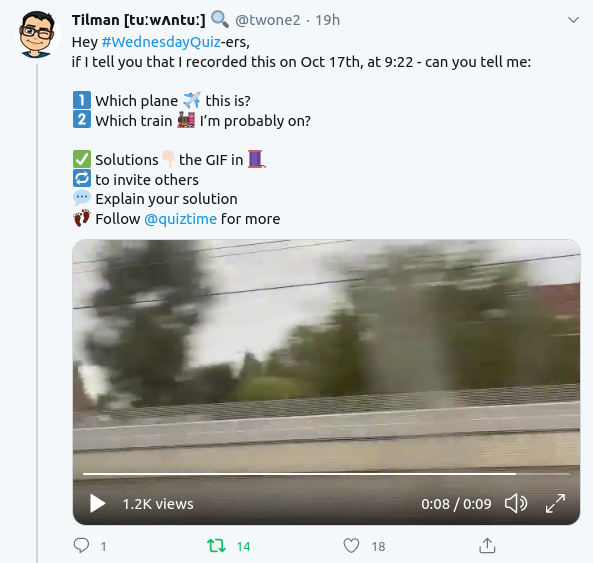
> 
> Tilman asks us to identify the train and the plane, but we can’t do
> either of those things until we know where he is, and instead of an
> image we get nine seconds of video footage to work with.
> 
> So how do we find out where he was? Working with video is harder than
> working with still images and if you tried to solve this by pausing
> and playing the video repeatedly then I admire your patience – but
> there are easier ways to get the information we need.
> 
> First I used [YouTube-dl](https://github.com/ytdl-org/youtube-dl) to
> download the video. Despite its name YouTube-dl can grab video content
> from pretty much any website, including Twitter. I’ve written a
> previous blog post about how to set up and use it, which you can
> read [here](https://nixintel.info/linux/grabbing-videos-for-osint-how-to-use-youtube-dl/).
> Once installed, the command to download the video and save it is as
> follows:
> 
> $ youtube-dl <https://twitter.com/twone2/status/1275870812017438726>
> -o trainvideo.mp4
> 
> Now we have our own copy of the video to work with. Next we can use
> FFMPEG to break up the video into lots of different still images which
> we can work with individually. I’ve also written about FFMPEG in the
> past [here.](https://nixintel.info/osint-tools/using-ffmpeg-to-grab-stills-and-audio-for-osint/)
> 
> To turn the video into still images run the following command:
> 
> $ ffmpeg -i trainvideo.mp4 img%06d.png
> 
> The default settings of FFMPEG mean that our 9 second video clip is
> turned into 298 still images that we can look at it more detail. No
> need to keep clicking pause to try and catch a glimpse of the station
> name.
> 
> Identifying Features For Geolocation
> 
> I admit the first thing I did was to try and see if the station name
> was captured in one of the stills. I was disappointed:
> 
> 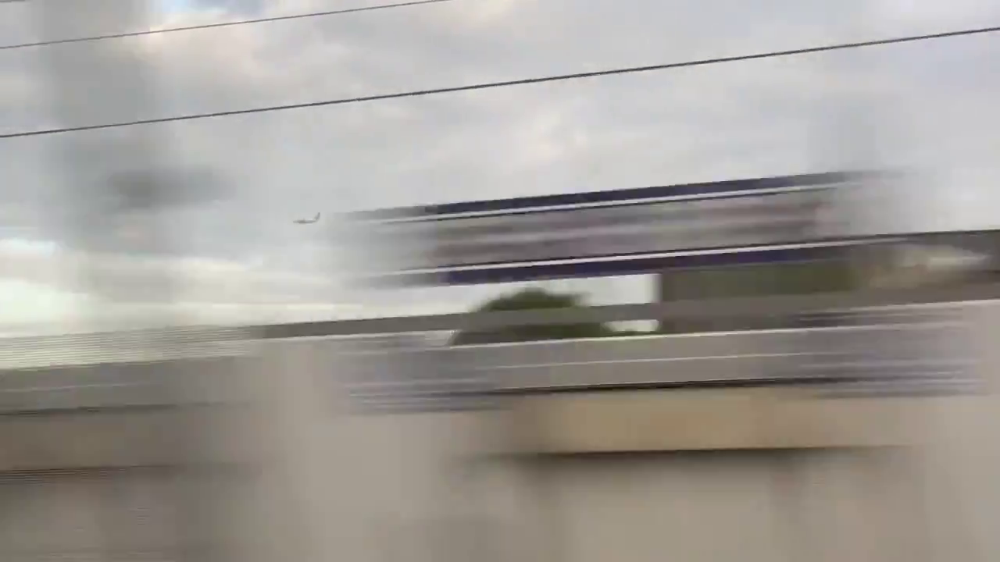
> 
> *Hmm.*
> 
>  
> 
> So there was going to be no immediate solution to this, but even so
> there were enough clues in the images to find where Tilman
> was. [Finding Tilman is not always
> easy](https://nixintel.info/osint/using-flight-tracking-for-geolocation-quiztime-30th-october-2019/) because
> he travels a lot so you cannot just assume he is in any given location
> at any particular time.
> 
> Once we identify some information about the location from the images,
> we can apply them as a set of conditions to check possible locations
> and see if they match. If a location does not match all the
> conditions, we can reject it as a possibility. If it does match all
> the conditions, then we have found the right location.
> 
> The first condition is obvious from watching the video: Tilman is on a
> train. The aeroplane we have to identify is travelling parallel to the
> railway line. But what is the plane doing? It is very low, so it must
> either be taking off or landing. It does not appear to be climbing, so
> it is more probable that it is landing. If it is landing, then it must
> be flying towards a runway. This means the runway it is landing on
> must be parallel with the train line that Tilman is travelling on.
> This gives us the first “true” condition:
> 
> 1\.*The location will be close to an airport and the train line will
> be roughly parallel with the alignment of the runway.*
> 
> We can get some other conditions from the images. It is easy to see
> that the landscape is quite flat farmland:
> 
> 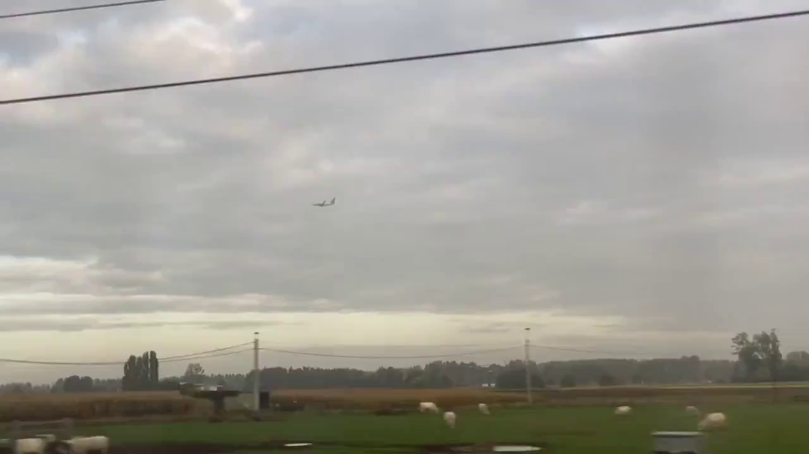
> 
> So condition \#2 is easy:
> 
> 2*. The correct location will be in a flat area that is rural or
> semi-rural.*
> 
> Thirdly we can see that a large number of houses have solar panels on
> the roof. Solar panels have to face the sun, so in Europe this means
> they generally face south or south-east. Several of the houses have
> solar panels so this helps with orientation:
> 
> 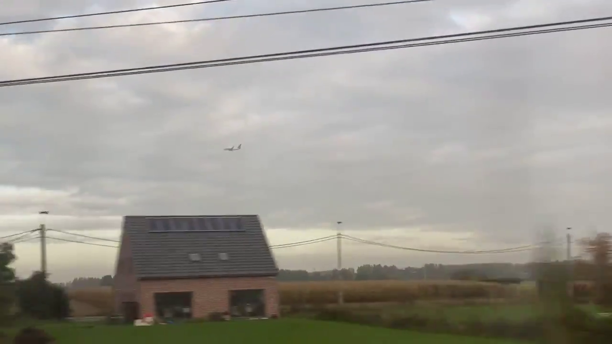
> 
>  
> 
> 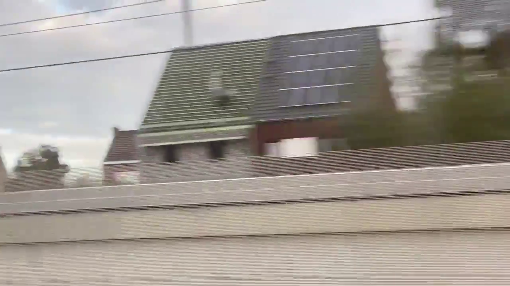
> 
> If these buildings are facing roughly south, then Tilman must be
> facing approximately north as he films them. This means that both
> Tilman and the plane are travelling roughly from east to west. We do
> not need to know the precise compass bearing, the general direction of
> travel is enough. This brings the third condition:
> 
> 3. *The location will be a train station on a railway line that runs
> roughly east-west and not north-south.*
> 
> Lastly there is the architecture. I don’t like to rely on these clues
> as much because architecture varies so much but the general style of
> the buildings reflects the Netherlands, Belgium, or parts of Germany.
> This could not be Austria, or the UK for example. This is our fourth
> and last condition:
> 
> 4. *The location is quite possibly in Germany, the Netherlands, or
> Belgium.*
> 
> Condition \#4 is not as strong as the others, but at least it gives an
> area to start our search.
> 
> Putting The Conditions To The Test
> 
> So we now have four conditions that we know to be true of the location
> where Tilman is. They are:
> 
> *1. Close to an airport, train line parallel with runway.*
> 
> *2. Flat, rural/semi-rural location.*
> 
> *3. Station on a line that is roughly east-west.*
> 
> *4. Possibly in Belgium, the Netherlands or Germany.*
> 
> To check for locations that match these conditions, we can use Google
> Earth Pro. To make it simple we can disable all the layers in the map
> except for place names, railways, and airports, like this:
> 
> 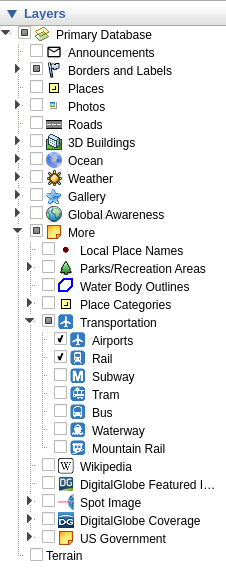
> 
> This leaves our target area looking like the image below. The railways
> are black lines, the airports are marked with the plane symbol:
> 
> 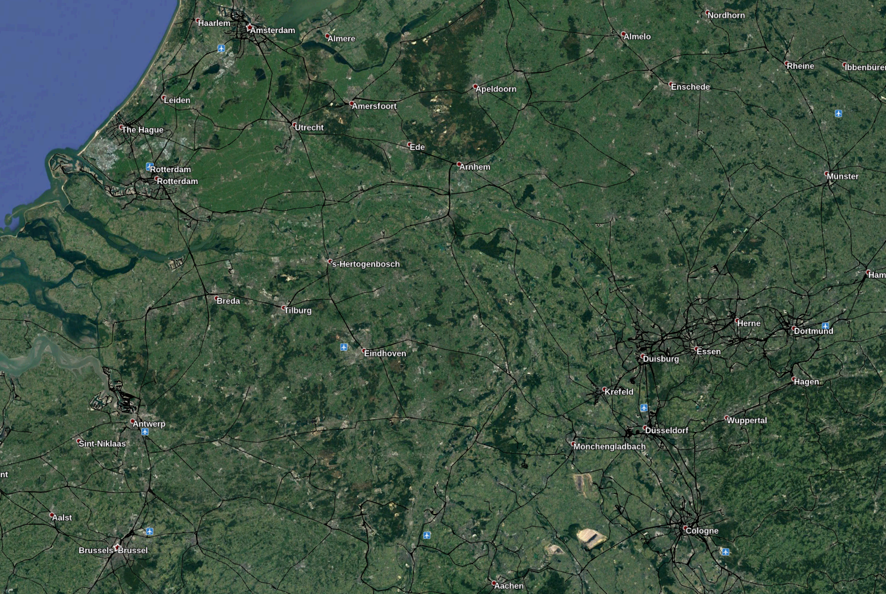
> 
> There are only a few airports, so it will not take long to check them.
> We can strictly apply our true conditions and immediately reject a lot
> of the possible candidates if they do not match all four conditions.
> Düsseldorf airport is next to a railway, but this line runs
> north-south and not east-west so it cannot be right. The same goes for
> Eindhoven, Cologne, Antwerp, and Rotterdam so we immediately reject
> them. Münster-Osnabrück is not near a railway at all, so we can reject
> that too. Amsterdam Schiphol has a railway line nearby that is
> parallel to one of the runways, could that be it?
> 
> 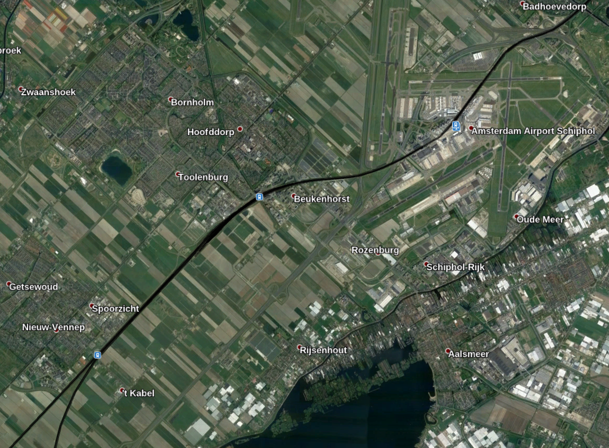
> 
> Nope. On closer inspection the orientation is impossible, Tilman could
> not look north from this train line and see a plane that is landing at
> Schiphol. A landing plane would be flying the opposite way to the one
> in the video. Schiphol might just meet conditions 2,3 and 4, but the
> angles aren’t right for condition 1, and so we can reject it. The most
> obvious remaining candidate is the airport at Brussels:
> 
>  
> 
> 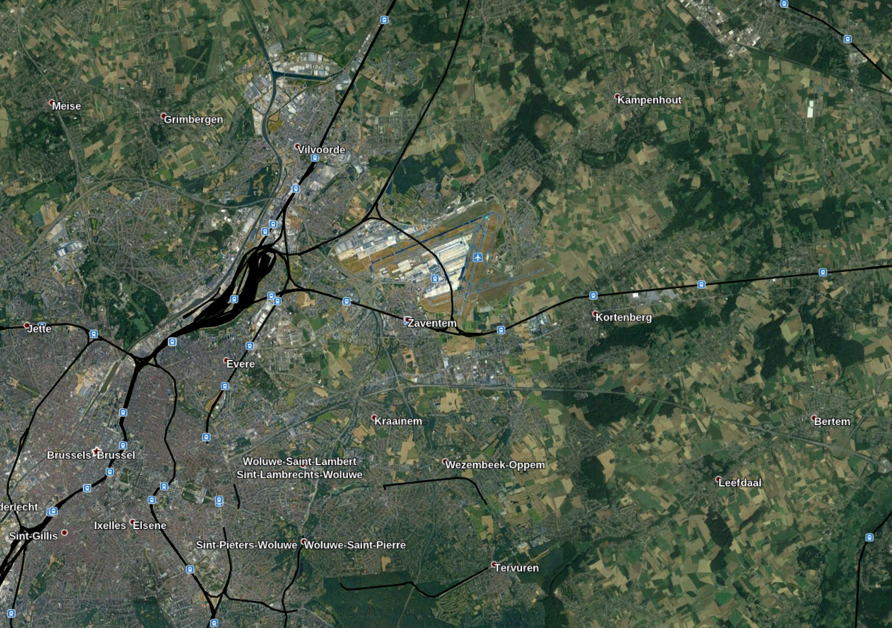
> 
> It meets all the conditions:
> 
> 1\. The railway line (the one going through Kortenberg) runs close to
> the airport, and is approximately parallel to the runway.
> 
> 2\. Flat rural/semi rural location.
> 
> 3\. The line runs along an east-west axis, so Tilman would have seen a
> landing plane to the north as he looked out.
> 
> 4\. It is in Belgium.
> 
> So is this right? It is certainly not wrong but now we need to zoom in
> and do a little verification to confirm.
> 
> Verifying The Location
> 
> 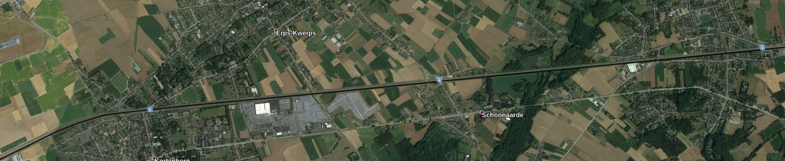
> 
> There are only three stations that Tilman could have passed through on
> this bit of line as he took the video: Kortenberg, Erps-Kwerps, and
> Veltem. We already know that Tilman was looking roughly north from the
> railway line because of the solar panels, so we should able to check
> if the location on Google Earth really matches the one in the video.
> We know that as Tilman approaches the station, he had a clear view
> across fields towards some distant trees.
> 
> This cannot be the case on the approach to Kortenberg because we
> cannot see the houses in this picture:
> 
> 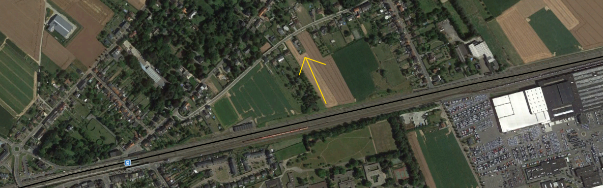
> 
> For the same reason it cannot be Veltem either:
> 
> 
> 
> Erps-Kwerps looks more promising though:
> 
> 
> 
> Now we need to focus on some details to see if what we’ve found at
> Erps-Kwerps matches with what we can see in the video. I’ve picked out
> some identifying features to check: a detached house with solar panels
> on the roof, three lamp posts, and a road:
> 
> 
> 
> We can compare them to Google Earth and find matches in the right
> place:
> 
> 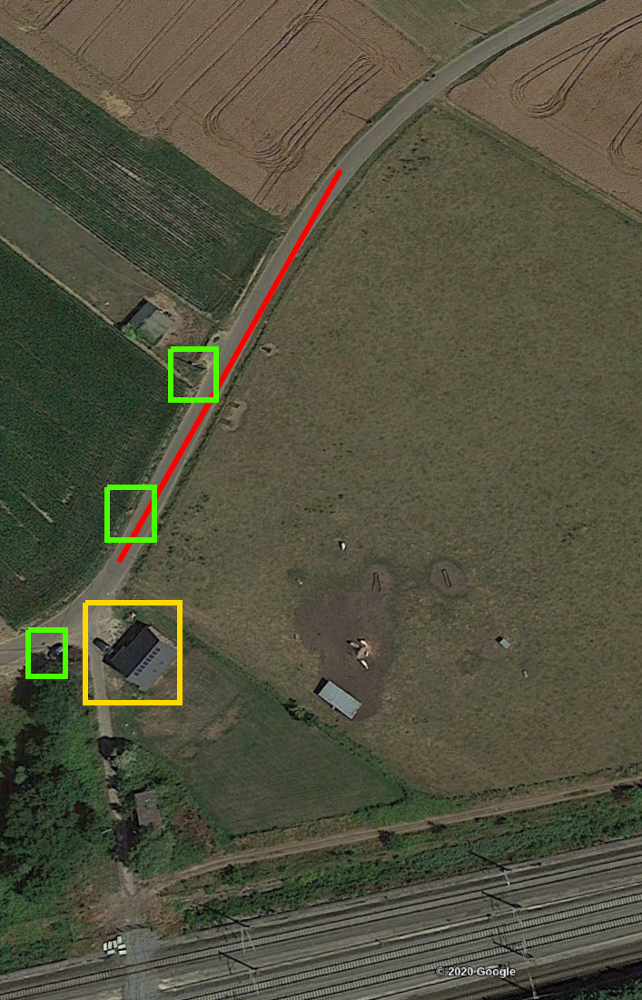
> 
> Looks good\! We can do one more check just to be certain. This house
> has a distinctive solar panel layout:
> 
> 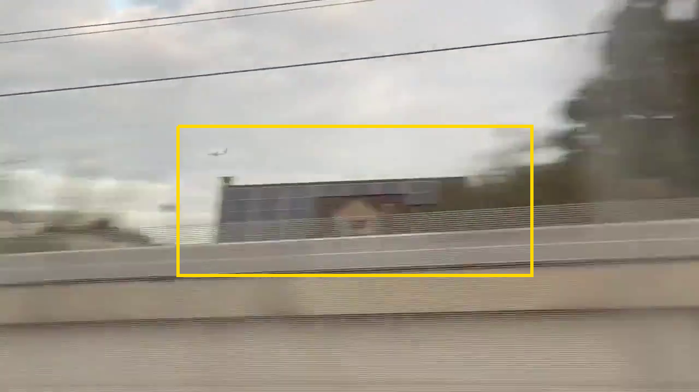
> 
>  
> 
> It matches perfectly with this house right next to the station:
> 
> 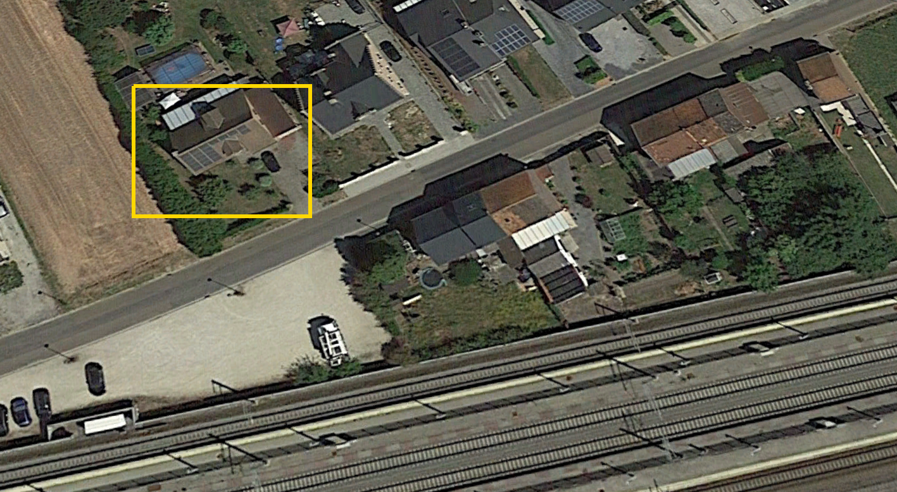
> 
> Perfect\! By being methodical from the outset we have used features in
> the original video to determine what conditions must be true of the
> correct location. We have then identified a location that matched all
> of our four conditions, and we have tested our hypothesis by comparing
> stills from the video to aerial photographs which confirm our
> hypothesis. The correct location is the [railway station at
> Erps-Kwerps in Belgium](https://goo.gl/maps/GcWD8uAKmdNgh9mD7).
> 
> Finding The Train
> 
> We’ve found the correct location, but now we have to find the train.
> When deciding what to do next in an investigation it is often useful
> to conduct a little [gap
> analysis](https://nixintel.info/osint/using-gap-analysis-to-keep-osint-investigations-on-track/) to
> review what we have learned and decide what we need to focus on
> next. *So what do we know?*

  - > This photo was taken on a train heading towards Brussels at 09:22
    > on 17th October 2019.

  - > The train was passing through Erps-Kwerps station, which is about
    > 12km from central Brussels.

> *What does this mean?*
> 
> If we can work out which trains arrive in Brussels after 09:22, we can
> work out which train Tilman was on. Given the travel time, the train
> should arrive sometime between 09:30 – 09:45.
> 
> *What do we need to know?*
> 
> Which trains arrive in Brussels between 09:30 – 09:45?
> 
> *How do we find out?*
> 
> Finding a train timetable which will show arrivals at the relevant
> period.
> 
> I couldn’t easily find a collection of historic Belgian train
> timetables, but I reasoned that since Tilman travelled on a Thursday,
> the train timetable for any other Thursday would be fairly similar.
> This was a slight risk, but train timetables are usually fairly
> consistent. This was the arrival schedule for Thursday 25th June at
> the relevant time period:
> 
> 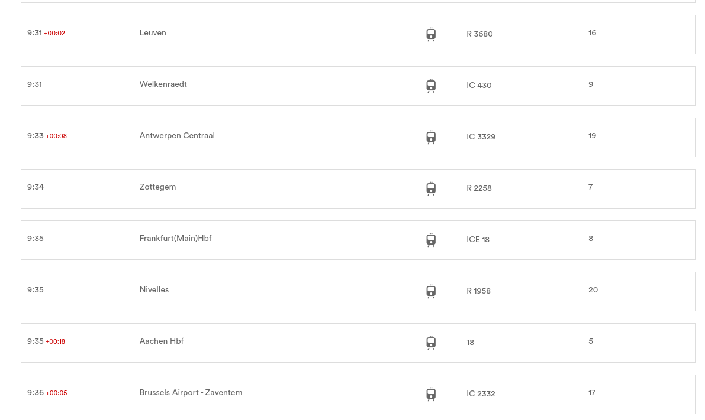
> 
> There are several possibilities, but the one that really stands out is
> the train from Frankfurt(Main)Hbf. The train service number is ICE 18.
> Tilman lives in Germany and [his Twitter
> history](https://twitter.com/search?lang=en-gb&q=\(bonn%20OR%20cologne\)%20\(from%3Atwone2\)&src=typed_query) suggests
> he is familiar with Bonn or Cologne, so I reasoned it was probable
> that he travelled to Brussels from that direction.
> 
> To be more certain it would be helpful to know a little bit more about
> the train timetables from October 2019. Fortunately there is
> a [searchable archive of historic German train
> timetables](https://grahnert.de/fernbahn/datenbank/) that we can check
> (I recommend adding this to your bookmarks if you take part in
> Quiztime regularly).
> 
> If we check [departures from Frankfurt in
> October 2019](https://grahnert.de/fernbahn/datenbank/suche/index.php?fahrplan_jahr=2019&fahrplan_tafel%5b%5d=ab&zug_gattung=&zug_gattung2%5b%5d=F&zug_gattung2%5b%5d=N&zug_gattung2%5b%5d=S&fahrplan_tage%5b%5d=0&fahrplan_tage%5b%5d=1&fahrplan_tage%5b%5d=2&fahrplan_tage%5b%5d=3&fahrplan_tage%5b%5d=4&fahrplan_tage%5b%5d=5&fahrplan_tage%5b%5d=6&bahnhofplan_ansicht=bahnhofstafel&fv_suche_fahrplan=Suchen&bahnhof_status=1&bahnhof_name=Frankfurt\(M\)Hbf) we
> can see that there is a service that leaves at 06:29 and stops in
> Cologne before heading to Brussels-Midi, [where it arrives
> at 09:35](https://grahnert.de/fernbahn/datenbank/suche/index.php?fahrplan_jahr=2019&fahrplan_tafel%5b%5d=ab&zug_gattung=&zug_gattung2%5b%5d=F&zug_gattung2%5b%5d=N&zug_gattung2%5b%5d=S&fahrplan_tage%5b%5d=0&fahrplan_tage%5b%5d=1&fahrplan_tage%5b%5d=2&fahrplan_tage%5b%5d=3&fahrplan_tage%5b%5d=4&fahrplan_tage%5b%5d=5&fahrplan_tage%5b%5d=6&bahnhofplan_ansicht=bahnhofstafel&fv_suche_fahrplan=Suchen&bahnhof_status=1&bahnhof_name=Frankfurt\(M\)Hbf&zug_id=20190100018).
> 
> 
> 
> This is the best fit for what we know about Tilman and what we have
> learned about the train journey in the video. The train is ICE 18 from
> Frankfurt to Brussels.
> 
> Finding The Plane
> 
> In theory the last part should be easy enough because we have already
> done the hard work. Unfortunately in practice it was harder to source
> the information than I had anticipated. We know the airport was
> Brussels, and we know the plane landed there at or about 09:22 on 17th
> October 2019. Easy right? All we need to do is visit a site
> like [FlightStats](https://www.flightstats.com/v2/), [FlightRadar24](https://www.flightradar24.com/), [FlightAware](https://flightaware.com/) or [Airportia](https://www.airportia.com/) and
> get a list of all the flights that arrived in Brussels at that time
> and identify the correct plane. The big issue with this is that
> accessing flight data that is more than a few days old gets really
> expensive. For example if I wanted to get data from FlightAware a
> single year’s worth of data would cost me about $400. As much as I
> love Quiztime, $400 to answer one quiz question makes it an expensive
> hobby.
> 
>  
> 
> 
> 
> *Enhance…*
> 
> 
> 
> Source image: <https://www.jetphotos.com/photo/9659627>
> 
> It wasn’t really possible to work back from today’s schedule and see
> if it matched with last October’s schedule in the way I had done for
> the train timetable either. Airline schedules are less predictable,
> and the impact of COVID has meant that flight schedules look
> completely different to how they did a few months ago. Instead I
> signed up for a trial of [FlightRadar24
> Gold](https://www.flightradar24.com/), which allows access to 12
> months’ worth of historic information. After no success with trying to
> match current flights with historic ones I was grateful for the [input
> of Philipp
> Bock](https://twitter.com/bockph/status/1276141086365356032) who
> pointed out that with a gold account it is possible recreate historic
> views of the sky from any point in the last 12 months using the air
> traffic map. He correctly identified that the flight at that time must
> have been [RO371 from Bucharest to
> Brussels](https://www.flightradar24.com/data/flights/ro371#228128c2).
> 
> Here we can see what the sky looked like at exactly 09:22 on 17th
> October 2019 and where the plane was relative to Tilman’s position at
> Erp-Kwerps at the time he made the video:
> 
> 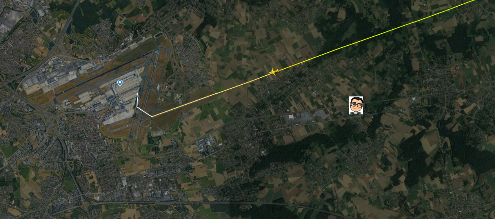
> 
> If you found this post useful, you can read the rest of my Quiztime
> posts [here](https://nixintel.info/tag/quiztime/).
> 
>  
> 
> *From
> \<<https://nixintel.info/osint/planes-trains-quiztime-24th-june-2020/>\>*
> 
>  
> 
>  

 

Image Deblurring

Monday, October 26, 2020

2:24 PM

 

TODO: Add more specific links for recommendations.

 

  - > <https://github.com/subeeshvasu/Awesome-Deblurring>

  - > <https://www.myheritage.nl/photo-enhancer>

>  

 

Facial Recognition

Tuesday, October 20, 2020

6:44 PM

 

  - > <https://pimeyes.com/en>
    
      - > There is limited free access, but is also paid.
        
          - > To get the information about the target from the free
            > version right-click, and digging into the HTML should get
            > it.
            
              - > NEEDS VERIFIED

 

 

Crime and Gang Related

Saturday, October 17, 2020

1:43 PM

 

<https://www.fbi.gov/resources/library/gang-reports>

<https://www.fbi.gov/file-repository/stats-services-publications-national-gang-report-2013/view>

<https://nicic.gov/gangs-security-threat-groups>

<https://www.ncjrs.gov/pdffiles1/nij/grants/249857.pdf>

<https://www.fbi.gov/investigate/violent-crime/gangs>

<https://www.nationalgangcenter.gov/>

<https://www.nationalgangcenter.gov/Blog/47/Gangs-and-Human-Trafficking>

<https://www.nationalgangcenter.gov/GANGINFO>

 

 

Dark Web

Tuesday, October 20, 2020

6:27 PM

 

Note - Maltego can be utilized to further search Dark Web crap.

 

TODO: Add Maltego Dark Web links here.

 

Various Links

  - > Grams
    
      - > <http://grams7enufi7jmdl.onion/>

  - > Hidden Wiki (older)
    
      - > <http://thehiddenwiki.org/>

  - > <https://ahmia.fi/>
    
      - > A Tor2Web.

  - > <https://iaca-darkweb-tools.com/>
    
      - > TODO - Review

  - > <https://github.com/alecmuffett/real-world-onion-sites>
    
      - > TODO - Review

Scripts

  - > <https://github.com/Shandymen/OSINT_Tools/blob/master/TorGrab.py>
    
      - > Queries Ahmia to dump results in your terminal.

 

 

International

Wednesday, October 28, 2020

11:33 AM

 

 

Air Traffic

Thursday, December 3, 2020

10:30 AM

 

 

Maritime

Wednesday, October 28, 2020

7:04 PM

 

  - > <https://www.marinetraffic.com/>

  - > <http://maritime-connector.com/>

  - > <http://vesselfinder.com/>

>  

 

Articles

Wednesday, October 28, 2020

7:04 PM

 

  - > <https://medium.com/@raebaker/osint-on-the-ocean-maritime-intelligence-gathering-techniques-2ee39e554fe1>

 

 

Vehicles

Wednesday, October 28, 2020

7:05 PM

 

  - > License plates
    
      - > <https://keyfindings.blog/2019/12/07/car-spotting-and-osint/>
    
      - > <https://www.riskint.blog/post/tracking-evil-corp-s-cars>

 

Articles

Wednesday, October 28, 2020

7:05 PM

  - > <https://keyfindings.blog/2019/12/07/car-spotting-and-osint/>

 

 

Business

Wednesday, February 24, 2021

3:48 PM

 

Import Records

Wednesday, February 24, 2021

3:48 PM

  - > <https://www.importyeti.com/>
    
      - > <https://www.importyeti.com/company/lovehoney>
